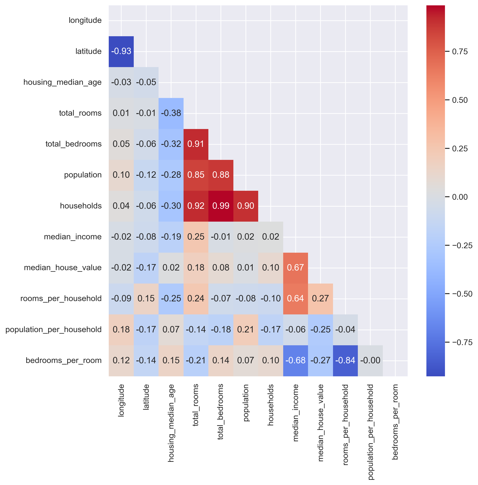
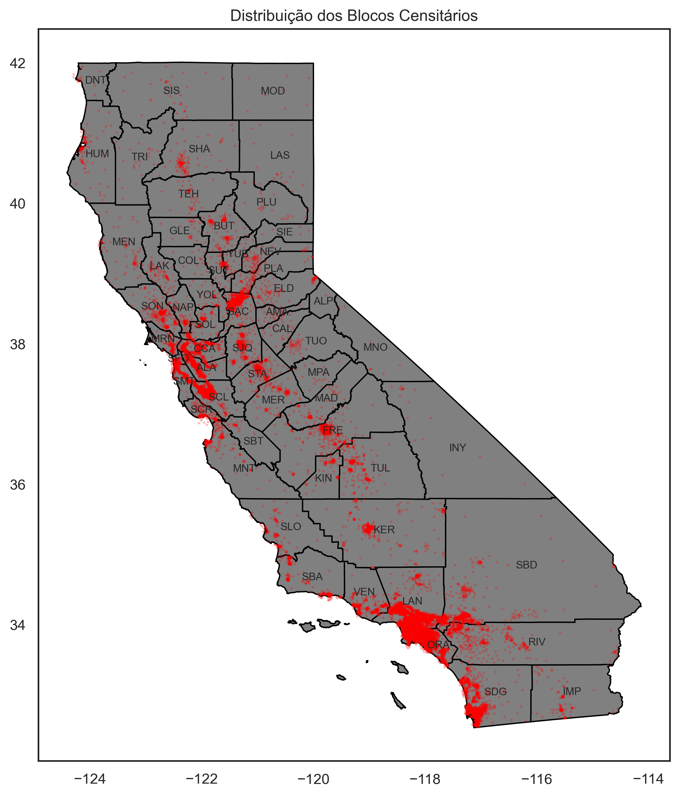
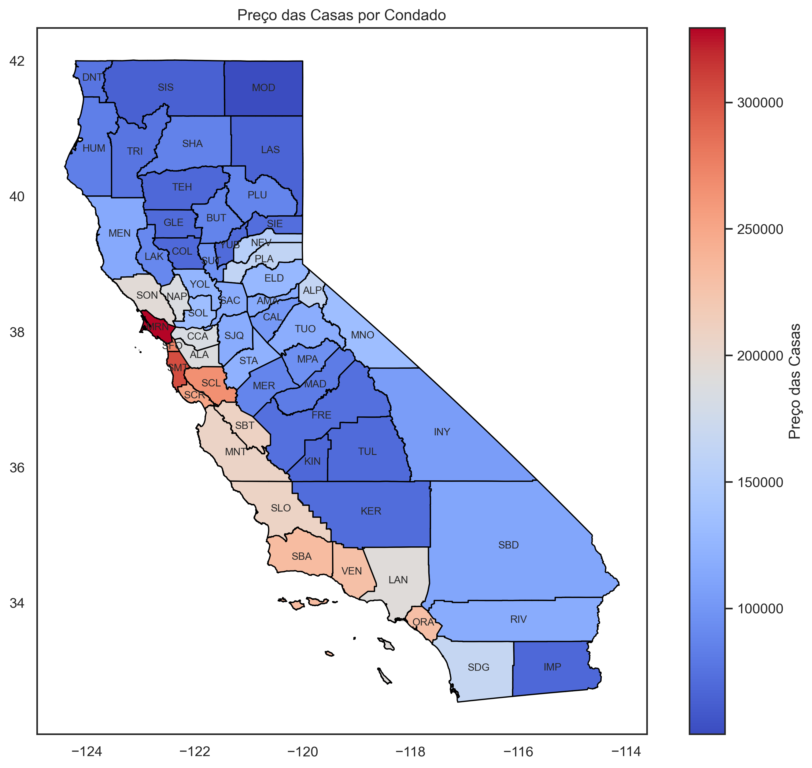
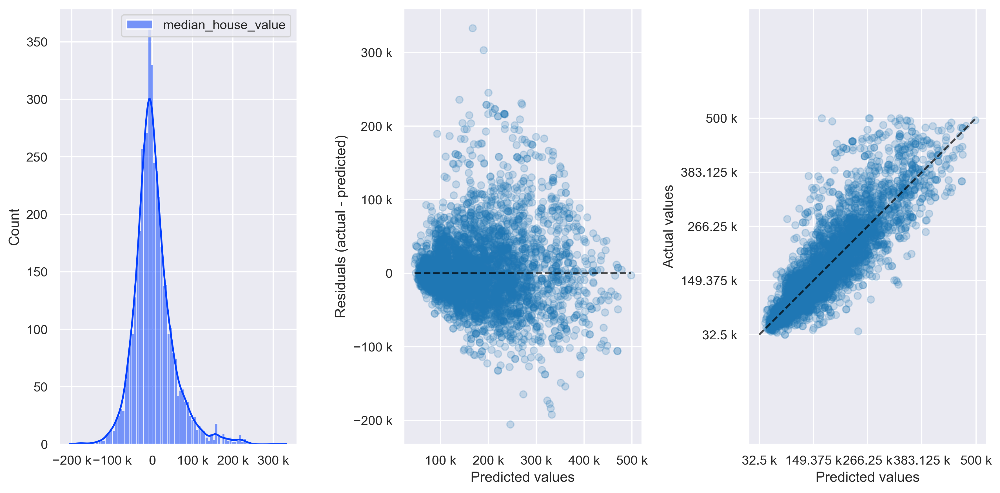

# Modelo de Regressão para Estimar o Valor de Imóveis na Califórnia  

**Origem da base de dados:** [Kaggle](https://www.kaggle.com/datasets/camnugent/california-housing-prices/data)

---

## Contexto  

Este conjunto de dados tem como base o Censo dos Estados Unidos de 1990 para a Califórnia. Cada linha do dataframe representa um **grupo de blocos censitários**, que é a menor divisão geográfica para a qual o Escritório do Censo dos EUA divulga dados amostrais.  

Um grupo de blocos geralmente possui entre 600 e 3.000 habitantes e é composto por diversos domicílios. Por esse motivo, os valores observados nas colunas relacionadas a cômodos, quartos e população costumam ser elevados, pois representam totais agregados da região — e não de uma única residência.  

Em alguns casos, esses números podem ser significativamente maiores que a média, já que determinados blocos podem incluir estruturas como hotéis, resorts ou grandes complexos residenciais, impactando os totais registrados.  

A variável alvo do modelo é o valor mediano das casas (**`median_house_value`**) expresso em dólares.  

---

## Variáveis (Features) do Conjunto de Dados  

- **`median_income`**: renda mediana do grupo de blocos (em dezenas de milhares de dólares)  
- **`housing_median_age`**: idade mediana das residências no grupo de blocos  
- **`total_rooms`**: total de cômodos existentes no grupo de blocos  
- **`total_bedrooms`**: total de quartos no grupo de blocos  
- **`population`**: população total do grupo de blocos  
- **`households`**: número de domicílios no grupo de blocos  
- **`latitude`**: latitude geográfica do grupo de blocos  
- **`longitude`**: longitude geográfica do grupo de blocos  
- **`ocean_proximity`**: categoria que indica a proximidade do oceano  
  - `NEAR BAY`: próximo à baía (de São Francisco) 
  - `<1H OCEAN`: a menos de uma hora do oceano  
  - `INLAND`: no interior do Estado  
  - `NEAR OCEAN`: próximo ao oceano  
  - `ISLAND`: localizado em ilha  
- **`median_house_value`**: valor mediano das casas no grupo de blocos (variável alvo - target)

## Etapas Realizadas
1) Realização da Análise Exploratória dos Dados - entender os padrões da base e fazer a preparação para a regressão
2) Exploração das informações da base do ponto de vista cartográfico (Análise Geográfica)  
3) Criação de um notebook “padrão” para o projeto de Machine Learning, com funções que facilitem o teste de diferentes modelos  
4) Melhorias no modelo de Machine Learning, sendo executadas as etapas abaixo:  
    - Iniciação com Regressão Linear, aplicando preprocessamento nas colunas categóricas (*OneHotEncoder* + *OrdinalEncoder*).  
    - Avaliação se a transformação da variável alvo melhora o desempenho do modelo e testar qual abordagem é mais adequada (*PowerTransformer* ou *QuantileTransformer*).  
    - Teste de diferentes formas de preprocessamento para as colunas numéricas (apenas *RobustScaler* ou *StandardScaler* + *PowerTransformer*), considerando a melhor transformação aplicada ao target.  
    - Aplicação de *Polynomial Features* para identificar qual grau polinomial proporciona melhor resultado.  
    - Substituição da Regressão Linear por *Elastic Net* para verificar se a regularização melhora o desempenho do modelo.  
    - Substituição do *ElasticNet* pelo regressor *Ridge*, ajustando seus principais parâmetros, para avaliar os resultados e definir o melhor modelo de regressão do projeto (tendo em vista que o melhor modelo de Elastic Net se aproximou do Ridge).
5) Construção de um app online para simulação do preço das Casas por Condado, Idade da Casa e Renda Média. 

## Principais resultados

Na análise exploratória foi feita a avaliação da correlação entre as variáveis do conjunto de dados. Quanto mais próximo de 1, mais proporcionais elas são, e quanto mais próximo de -1, mais inversamente proporcionais elas são.



O blocos censitários utilizados para a construção do modelo podem ser vistos no mapa abaixo:



Agregando as variáveis por Condados (subdivisões do Estado da Califórnia), é possível entender onde estão localizadas as casas de maior valor:  



A mesma agregação para renda dos moradores e idade dos domícios foi gerada e consta na pasta de [imagens](relatorios/imagens).

O modelo final resultou nas seguintes métricas após o teste:



O primeiro gráfico é a distribuição de erro, o segundo é quanto houve de erro em relação aos valores previstos e o terceiro valores da base vs os previstos. Quanto mais próximo da linha pontilhada melhor a performance do modelo para aquela faixa de valores de preço.

## Interaja com o modelo

Use o site abaixo para interagir com meu modelo:

[](https://prev-preco-casas-california.streamlit.app/)

Basta:
- Selecionar um condado
- Informar a idade do imóvel (em anos)
- Definir a renda média do morador (em milhares de US$) - quão luxuosa é a casa

## Organização do projeto

```
├── .env               <- Arquivo de variáveis de ambiente (não versionar)
├── .gitignore         <- Arquivos e diretórios a serem ignorados pelo Git
├── requirements.txt   <- O arquivo de requisitos para reproduzir o ambiente de análise
├── LICENSE            <- Licença de código aberto se uma for escolhida
├── README.md          <- README principal para desenvolvedores que usam este projeto.
├── home.py            <- Arquivo que roda o aplicativo do Streamlit
|
├── dados              <- Arquivos de dados para o projeto.
|
├── modelos            <- Modelos treinados e serializados, previsões de modelos ou resumos de modelos
|
├── notebooks          <- Arquivos de código utilizados para analisar, tratar a base e desenvolver o modelo de regressão
│
|   └──src             <- Código-fonte para uso neste projeto.
|      │
|      ├── config.py        <- Configurações básicas do projeto
|      ├── graficos.py      <- Scripts para criar visualizações exploratórias e orientadas a resultados
|      └── models.py        <- Scripts para executar o modelo de regressão e mensurar a eficácia do modelo
|
├── referencias        <- Dicionários de dados, manuais e todos os outros materiais explicativos.
|
├── relatorios         <- Análises geradas em HTML, PDF, LaTeX, etc.
│   └── imagens        <- Gráficos e figuras gerados para serem usados em relatórios
```
